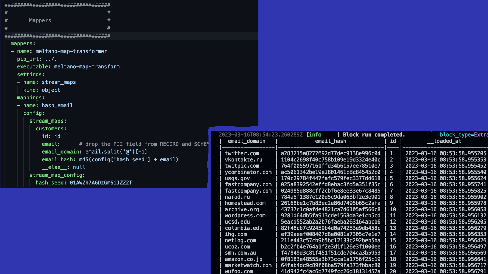

# meltano-map-transformer



[](https://results.pre-commit.ci/latest/github/MeltanoLabs/meltano-map-transform/main)

A map transformer to duplicate, filter, hash, mask and do many more small transformations in your extract & load pipelines. Implements the [`Stream Maps` capability](https://sdk.meltano.com/en/latest/stream_maps.html).

This mapper plugin is fully compliant with the Singer Spec and can be placed in between any Singer tap and target.

## meltano-map-transformer in action

For a collection of examples, take a look at [examples/README.md](examples/README.md).

## Settings

| Setting             | Required | Default | Description |
|:--------------------|:--------:|:-------:|:------------|
| stream_maps         | True     | None    | Stream maps |
| flattening_enabled  | False    | None    | 'True' to enable schema flattening and automatically expand nested properties. |
| flattening_max_depth| False    | None    | The max depth to flatten schemas. |
| stream_map_config   | False    | None    | User-defined config values to be used within map expressions. |

A full list of supported settings and capabilities is available by running: `meltano-map-transformer --about`

## Installation

We recommend using GitHub release tags when installing with `pip`. We also recommend using `pipx` or `meltano` instead of installing with `pip` directly.

You can see a full list of published releases [here](https://github.com/MeltanoLabs/meltano-map-transform/releases).

For example:

```shell
# Use `uv` so that virtual environments are managed automatically:
uv tool install meltano-map-transform==0.10.0

# Alternatively, use `pipx`:
pipx install meltano-map-transform==0.10.0
```

### Meltano installation instructions

1. Add this plugin to your Meltano project

   ```console
   meltano add mapper meltano-map-transformer
   ```

1. Install the plugin

   ```console
   meltano install
   ```

1. Configure the plugin

   ```yaml
   # meltano.yml
   plugins:
     mappers:
     - name: meltano-map-transformer
       pip_url: meltano-map-transform
       executable: meltano-map-transform
       mappings:
       - name: hash_email
         config:
           stream_maps:
             customers:
               email: null # drop the PII field from RECORD and SCHEMA messages
               email_domain: email.split('@')[-1]
               email_hash: md5(config['hash_seed'] + email)
               __else__: null # drop all other fields
           stream_map_config:
             hash_seed: 01AWZh7A6DzGm6iJZZ2T
    ```

1. Use the plugin in your pipelines

   ```console
   meltano run tap-csv hash_email target-sqlite
   ```

## Capabilities

* `stream-maps`

## Settings

| Setting     | Required | Default | Description |
|:------------|:--------:|:-------:|:------------|
| stream_maps | True     | None    | Stream maps |

A full list of supported settings and capabilities is available by running: `meltano-map-transformer --about`
